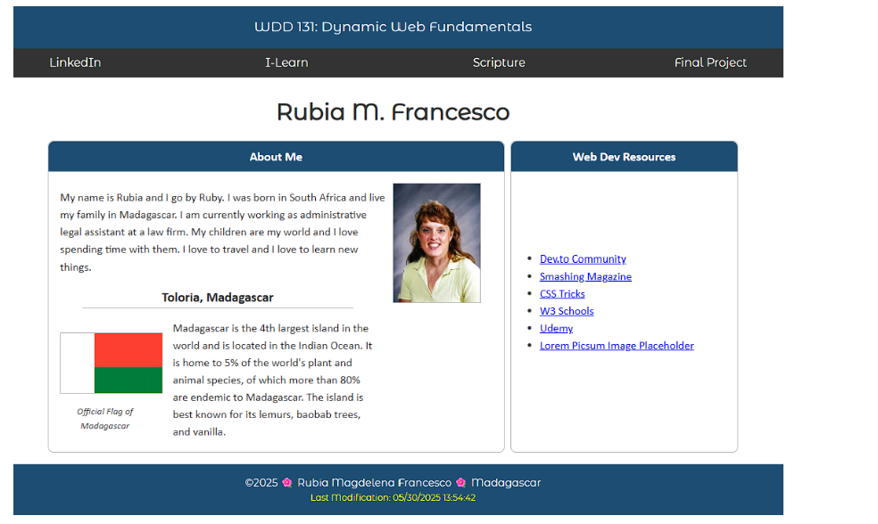

# W01 Assignment: Home Page

## Overview

This assignment allows you to demonstrate your prerequisite knowledge by applying HTML and CSS in the design and development of a home page. In addition, you will need to apply learning activity concepts – including JavaScript – to provide some dynamic information to the home page.

## Task

Design and develop the following home page as your wdd131 course landing page. Use your own content and basic styling.

Example Home Page Screenshot
Example Home Page Screenshot

## Instructions

File and Folder Setup
1. In VS Code, open the wdd131 local repository folder.
1. Create a new page in this root folder named "index.html".

Why is this file named "index.html"?

## Check Your Understanding

1. Create new folders (directories) named "styles", "scripts", and "images'.
1. These subfolders, on the repository root directory, will contain the relevant, asset files.
1. Note that 'directory' and 'folder' essentially have the same meaning. Directory is the more accurate term for file systems while 'folder' 📂 refers to the widely accepted graphical metaphor because of its association with physical files and organization.

1. Add a CSS file named "base.css" to the styles directory. This is your main CSS file.
1. Add a JS file named "getdates.js" to the scripts directory.

HTML
In the index.html document, include the:
required document type definition
html tag with language attribute
head tag
body tag
1. In the <head>, include the following elements with appropriate attributes and content:
1. Refer to the frontend development standards if you need to review any of these <head> elements.

meta charset
meta viewport
title
meta description
meta author
1. Set the title content to "WDD 131 – Dynamic Web Fundamentals – Your Name".
1. Phrase the meta description that it at least contains the following content:

"WDD 131 – Dynamic Web Fundamentals"

Your full name
Keyword summary of the page content
1. In the <body>, create a layout using a header, a main, and a footer element.
1. The <header> element contains:

the page heading text as shown in an <span> tag with an id attribute of "course-title". The content is "WDD 131 – Dynamic Web Fundamentals"
1. a <nav> tag with these four menu links:
1. Your LinkedIn profile page.
1. If you do not have a free LinkedIn account profile, consider making one or just provide a general link to LinkedIn.

Canvas using https://byupw.instructure.com/.
Link to a favorite Scripture using https://www.churchofjesuschrist.org/study/scriptures
Example
<https://www.churchofjesuschrist.org/study/scriptures/bofm/1-ne/3?lang=eng&id=p7#p7>

1. Final Project folder link (this will be a placeholder for now).
1. The <main> element contains the following:
1. The h1 tag with your name as the content.
1. Two section tags each with the class attribute named "card". These sections should include a heading, images, and content as shown in the example figure above.
1. In this class, all images must be optimized and must be local (no external, absolute references to images).

1. The <footer> has two paragraphs p:
1. The first paragraph contains the following:
1. The copyright symbol and current year where the year will be dynamically populated using JavaScript code. Provide a blank <span> tag to do this.

Example

```html
<span id="currentyear"></span>
```

1. Your name.
1. Your state or country.
1. The second paragraph has an id of "lastModified" and will be populated with JavaScript code.

CSS
Use the external base.css file to layout and style the page as shown in the example screenshot above.

1. Use your color schema and typography choices.
1. You are responsible to practice good design principles of alignment, color contrast, proximity, repetition, and usability in all of your work.
1. Use the Google Fonts API to select one or two fonts to use on the page.

If you need help using Google Fonts, watch this demonstration video ▶️ Google Fonts API

1. Make the span tag in the header to display as a block, display: block; in order to center the logo and text easily.
1. Use CSS Flex on the navigation nav.

Demonstration Video: ▶️ CSS Flex Navigation Menu
CodePen ☼ CSS Flex Menu
1. The navigation must employ a well designed hover affect. See the CodePen above for an example.
1. The main element has a limited width and is centered on the screen horizontally.
1. Layout the main column cards using CSS Grid.

JavaScript
Reference the "getdates.js" JavaScript file by using a <script> reference in the head of the HTML file and using the attribute defer.
Why is the defer boolean attribute important?
How else can we successful reference and employ JavaScript?
In getdates.js, write JavaScript statements that dynamically output the following:
the copyright year (the current year) in the footer's first paragraph, and
1. Note this CodePen ☼ JavaScript Date Object summary of using the Date object in different ways.
1. the date the document was last modified in the second paragraph.
1. Use the lastModified property of the document object to get this date/time dynamically. An example of this is shown below:

```js
document.getElementById("lastModified").innerHTML = document.lastModified;
```

Note that document.lastModified returns a simple string in JavaScript. Therefore, you do not need to manipulate its output for this assignment.

## Testing

Demonstration Video: ▶️ Testing and auditing your own work

1. Continuously check your work by rendering the page locally using Live/Five Server in VS Code.
1. Screenshot of console error icon in DevToolsUse the browser's DevTools to check for JavaScript runtime errors in the console or click the red, error icon in the upper right corner of DevTools.
1. "DevTools" is an abbreviation for "Developer Tools." It refers to a set of tools or utilities provided by web browsers to help developers debug, profile, and analyze web pages during the development process. The tools are typically accessed by pressing the F12 function key or selecting the menu option for the browser's developer tools.

1. Use DevTools CSS Overview to check your color contrast.
1. Generate the DevTools Lighthouse report and run diagnostics for Accessibility, Best Practices, and SEO in the Desktop view.
1. The DevTools Lighthouse tool serves as a comprehensive auditing tool integrated into the browser. In this class, you will focus on accessibility, best practices, SEO (Search Engine Optimization), and page weight measured by the total transfer bytes when the page is hard reloaded from an empty cache.

For more information, see the Lighthouse documentation.

It is best to test your page in a Private or Incognito browser window.

1. Hard reload the page using Empty Cache and Hard Reload in DevTools with the Network tab open to view the total transferred bytes at the bottom of the tab. Check that the page is 500 kB or less. Here are some common things to look for if the page is too large:
1. Make sure that all images are optimized.
1. Do not use third party libraries that bloat your page.

Submission and Audit
1. Commit your local repository and push or upload your work to your GitHub Pages enabled wdd131 repository on GitHub.
1. Use this ✔ Audit tool to self-check your work for some of the required HTML elements and CSS content. This audit tool is also used as part of the assessment.
1. Share your work by posting your URL in the course's Microsoft Teams Week 01 Forum and comment on your peers' work by providing constructive feedback.
1. If you do not see all the channels in the course's Microsoft Teams, unhide channels by clicking on the kebab "..." icon next to the team name and selecting "Show" for any hidden channels.

Return to Canvas and submit your GitHub Pages enabled URL for wdd131.
<https://your-github-username.github.io/wdd131>
Note that you do not need to include index.html in your reference because index.html is the default file



<https://byui-cse.github.io/cse-ww-program/student/dev-standards.html>

<https://fonts.google.com/>

<https://video.byui.edu/media/t/1_b7w4k0v0>

<https://codepen.io/BYU-Idaho/pen/azoRxXX>

<https://codepen.io/BYU-Idaho/pen/VYZQRma>

<https://www.loom.com/share/f0ef63190bfe429aa608a4966fac92f9>

<https://developer.chrome.com/docs/devtools/css-overview/>

<https://developer.chrome.com/docs/lighthouse/overview/>
