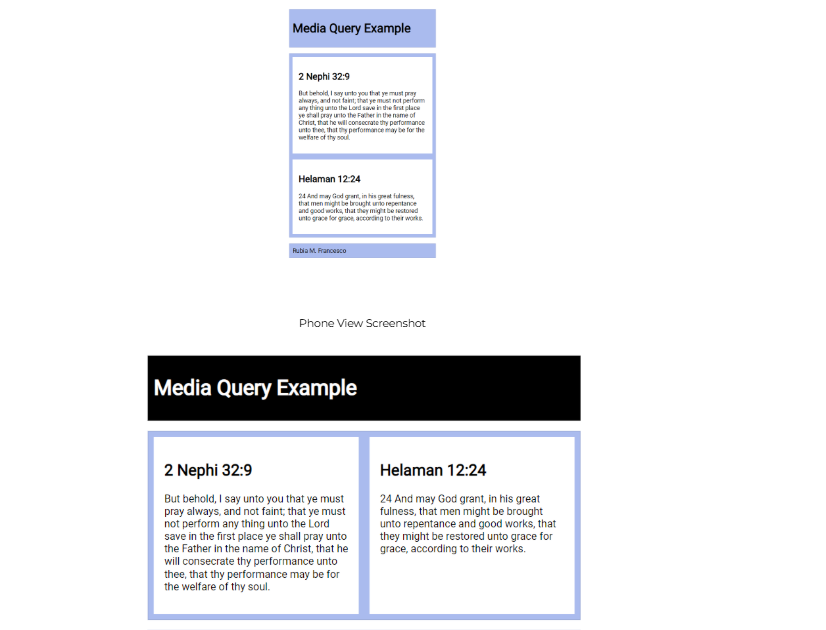

# W02 Learning Activities: CSS Media Queries

## Overview

CSS media queries let you apply different styles to your website based on the characteristics of the device being used to view it. They allow the site to adapt to different screen sizes, orientations, and even user preferences.

1. Associated Course Learning Outcome(s)
1. Develop responsive web pages that follow best practices and use valid HTML and CSS.

## Prepare

CSS media queries are essential to responsive web design. The @media at-rule specifies condition(s) that determine when a block of CSS rules should be applied. This lets selected elements be repositioned, resized, hidden, or shown based on the user's viewport size.

Here is the general syntax for setting up a CSS media query:

@media not|only mediatype and (expressions) {
/* CSS rules go here inside the @media query's opening and closing curly brackets {} */

```js
}
```

Here is an example CSS media query:

1️⃣ @media screen and (min-width: 640px) {
2️⃣   h1 {

```js
3️⃣     font-size: 2.5rem;
```

4️⃣     margin: 1rem;
5️⃣     color: navy;
6️⃣   }
7️⃣ }
Code explanation
1️⃣ @media screen and (min-width: 640px) { is the signature line of the @media query block that applies CSS rules when the specified conditions are met. In this example, the conditions require the media type to be a screen and the viewport width to be at least 640 pixels.

2️⃣ h1 { <h1> element selector starts the defined CSS rule.

3️⃣-5️⃣ font-size: 2.5rem; margin: 1rem; color: navy; are declarations to be applied to any <h1> elements if the @media query conditions are met.

6️⃣ The first } closes the CSS rule for <h1> code elements.

7️⃣ The last } closes the media query.

Note that curly brackets { } are used to contain a specific media query and are also used to define CSS Rules. A common mistake is to close the @media query container too soon or not at all. Using the automatic indentation feature of VS Code document formatting features will help you recognize issues with your CSS syntax.

Demonstration Video: ▶️ Media Queries – [ 2:54 minutes ]

## Activity Instructions

For this activity, you will create a simple HTML page with two CSS files. You will use CSS media queries to apply the appropriate CSS file based on the viewport width.

A responsible use of an AI generative tool could be to ask questions about how to formulate a specific code piece. For example, "how to combine selectors in CSS", and an example will be given with which you can apply to your own code.

File and Folder Setup
1. Add a new HTML file named "media-query.html" in a "week02" folder in your wdd131 repository.
1. Add two CSS files named "media-query.css" and "media-query-large.css" to a subfolder named "styles" within the week02 folder.

HTML
In your media-query.html file, create a valid HTML page with standard head content, including
Meta Charset
Meta Viewport
Title Element
Meta Description Element
Meta Author Element
Link to a Google Font named "Roboto" using the contemporary code embed provided by fonts.google.com
Links to your two CSS files.
Example

```html
<head>
  <meta charset="utf-8">
  <meta name="viewport" content="width=device-width, initial-scale=1.0">

<title>WDD 131 – Media Query Example</title>

  <meta name="description" content="Media query learning activity example page.">
  <meta name="author" content="[Put your full name here]">
  <link rel="preconnect" href="https://fonts.googleapis.com">
  <link rel="preconnect" href="https://fonts.gstatic.com" crossorigin>
  <link href="https://fonts.googleapis.com/css2?family=Roboto&display=swap" rel="stylesheet">
  <link rel="stylesheet" href="styles/media-query.css">
  <link rel="stylesheet" href="styles/media-query-large.css">
</head>
```

1. In the body of the HTML document, add a header with an h1, a main element with two section elements, and a footer element.
1. The h1 element should contain the words "Media Query Example".
1. Each section h2 heading contains a scripture with book, chapter, and verse.
1. Each section paragraph contains the scripture referenced in its heading.
1. The footer should contain your name.

Example

```html
<header>

<h1>Media Query Example</h1>

</header>
<main>
  <section>

<h2>2 Nephi 32:9</h2>
<p>But behold, I say unto you that ye must pray always, and not faint; that ye must not perform any thing unto the Lord save in the first place ye shall pray unto the Father in the name of Christ, that he will consecrate thy performance unto thee, that thy performance may be for the welfare of thy soul.</p>

  </section>
  <section>

<h2>Helaman 12:24</h2>
<p>And may God grant, in his great fulness, that men might be brought unto repentance and good works, that they might be restored unto grace for grace, according to their works.</p>

  </section>
</main>
<footer>
```

[Your Full Name Here]

```html
</footer>
```

CSS
Style the document as shown in the example screenshots below.
media-query.css
1. Do not include a media query.
1. Use the Google Font – Roboto in the body rule.

The header, main, and footer
Each have a maximum width of 640 pixels
are centered on the page using margin: 1rem auto
include a faint border
use appropriate padding
have a blueish background color of your choice
Remember that you can combine these three selectors into one rule or create a class that contains these common CSS declarations.

Declare the main element as a CSS grid with one column and an equal gap of 1rem.
If you had a question to pose to the class in Microsoft Teams Week 02 Forum channel, use specific and descriptive language. For example, "I have a question about media-query assignment part 5.1.4. I do not know how to set the main element grid to one column with a 1rem gap."

Declare the section elements to also have padding and a lighter or white background.

## Check Your Understanding

body {
font-family: 'Roboto', sans-serif;

```js
}
```

header, main, footer {
max-width: 640px;

margin: 1rem auto;
border: 1px solid #bbb;
padding: 1rem;

background-color: #e6f2ff;

```js
}
```

main {

display: grid;

grid-template-columns: 1fr;
grid-gap: 1rem;

```js
}
```

section {

padding: 1rem;

background-color: #fff;

```js
}
```

1. In the media-query-large.css:
1. Write a containing media query to be applied at a viewport width of 500px or greater.

## Check Your Understanding

1. @media screen and (min-width: 500px)
1. Within that media query, change the header to a black background with white text.
1. Change the main element to display two columns of equal size.

## Check Your Understanding

grid-template-columns: 1fr 1fr;
Example Screenshots
Screenshot of media query example in the mobile view.
Phone View Screenshot
Screenshot of media query example in the large view
Wider View Screenshot

## Check Your Understanding

Example solution on CodePen ☼ CSS Media Queries Activity

Setting Breakpoints
Breakpoints should be set to support the design and content of the page. There are no set breakpoints to use.

"Do NOT define breakpoints based on device classes. Defining breakpoints based on specific devices, products, brand names, or operating systems that are in use today can result in a maintenance nightmare. Instead, the content itself should determine how the layout adjusts to its container."

How to choose breakpoints – Responsive Web – Google Web Fundamentals

## Testing

Continuously check your rendered work in the browser using the Live Server or Five Server extension.

1. Test your work by resizing your browser window or by using DevTools device settings to see the changes in the layout.
1. Use the browser's DevTool CSS Overview to check color contrast and other CSS properties.
1. Discuss issues with your peers and the instructor in the Microsoft Teams Week 02 Forum channel.



<https://video.byui.edu/media/t/0_oacos9ak>

<https://codepen.io/BYU-Idaho/pen/bNbBWMq>

<https://web.dev/articles/responsive-web-design-basics#breakpoints>

<https://developer.chrome.com/docs/devtools/device-mode/>

<https://learn.microsoft.com/en-us/microsoft-edge/devtools/css/css-overview-tool>
