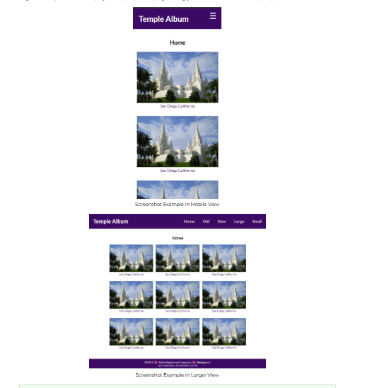

# W02 Assignment: Picture Album

## Overview

This assignment applies the concepts presented in the learning activities to a picture album page that is responsive in both small and larger views. This page will utilize a 'hamburger' menu and respond to user interaction.

## Associated Course Learning Outcomes

1. Develop responsive web pages that follow best practices and use valid HTML and CSS.
1. Demonstrate proficiency with JavaScript language syntax.
1. Use JavaScript to respond to events and dynamically modify HTML.

## Task

Design, develop, test, and deploy a temple album page using your own selection of temple pictures.

Example Picture Album Page Screenshot – Mobile
Screenshot Example in Mobile View
Example Picture Album Page Screenshot – Larger
Screenshot Example in Larger View
Demonstration of Responsive Behavior
responsive example

## Instructions

File and Folder Setup
1. In VS Code, open the wdd131 local repository folder.
1. In the root folder (wdd131), create a new file named "temples.html".
1. Add two CSS files named "temples.css" and "temples-large.css" to the styles directory.
1. Add a JavaScript file named "temples.js" to the scripts directory.

HTML
1. In the temples.html document, include the standard HTML document and <head> elements.
1. Refer to the development standards if you need a review.

1. Add links to the CSS files in the proper order to support mobile-first development.
1. Add a deferred <script> reference to the JavaScript file.
1. In the <body>, create a basic layout using a header, a main, and a footer as main-level elements.
1. The <header> element contains:

text that says "Temple Album"
a <nav> menu with the following text links:
Home
Old
New
Large
Small
The <main> element contains the following:
an <h1> heading element
1. at least (9) <figure> elements with temple images and captions. Use the built-in figcaption element to name each temple.
1. It is OK to use a single placeholder temple image at this point in the course.

The <footer> contains the same dynamic and static information found on your home page from last week.
Common Footer Screenshot Example
Screenshot Example of Common Footer
CSS
Use the external temples.css and temples-large.css files to lay out and style the page as shown in the example screenshots. Your design must support a responsive view in both mobile and larger views.

1. The temples.css file is used for the mobile view, and the temples-large.css file is used for the larger view.
1. Most of your CSS should be located in the temples.css file in mobile-first design.

1. Use your own color scheme.
1. Please note: You are responsible to practice good design principles of alignment, color contrast, proximity, repetition, and consistent white space.

Use your own typography choice by using the Google Fonts API service to select one or two fonts to use on the page.
Video Demonstration: ▶️ Using Google Fonts – [ 1:56 minutes ]

Use CSS Flex on the nav element.
Video Demonstration: ▶️ CSS Flex Navigation Menu – [ 7:58 minutes ]
CodePen ☼ Navigation Menu using CSS Flex

The navigation must employ a hover effect. See the CodePen above for an example.

## Check Your Understanding

Consider using the hover pseudo-class to change the design for the menu item that has the focus.
nav a:hover { ... }
The main element has a limited width and is centered on the screen horizontally.

## Check Your Understanding

Consider using the max-width property to limit the width and margin property to center the main element on the screen.
/* This is only an example to consider */
main {
max-width: 800px;

margin: 0 auto;

```js
}
```

1. Layout the main column figure elements using CSS Grid. In the mobile view, there should only be one (1) column.
1. The application of CSS Grid to support a responsive view is up to you.

1. Some of the options include:
1. Use grid-template-columns with specific fr changes in the media query.
1. Use grid-template-columns property with a repeat function and auto-fit and minmax function.

CodePen ☼ Grid Column Layouts and Image Effects
Look at the CSS for the .container class.

JavaScript
To improve organization and maintainability, it is required to place all JavaScript code in external files.

1. Support the footer copyright year and last modified date output using JavaScript. You can use an existing JavaScript file or create the new temples.js file.
1. Apply a responsive hamburger effect to your existing navigation menu using JavaScript.
1. The hamburger button should only show in the mobile view.
1. Clicking the hamburger button toggles the navigation menu items from viewable to not viewable.
1. Use a symbol, such as an 'X' to close the hamburger menu.

## Testing

1. Continuously check your work by rendering the page locally using the Live Server or Five Server extension in VS Code.
1. Screenshot of console error icon in DevToolsUse the browser's DevTools to check for JavaScript runtime errors in the Console tab, or click the red error icon in the upper right corner of DevTools.
1. Use DevTools CSS Overview to check your color contrast.
1. Generate the DevTools Lighthouse report and run diagnostics for Accessibility, Best Practices, and SEO in both the mobile and desktop views.
1. It is best to test your page in a Private or Incognito browser window.

1. Hard reload the page using Empty Cache and Hard Reload in DevTools with the Network tab open to view the total transferred bytes at the bottom of the tab. Verify that the page is 500 kB or less.
1. Make sure all images are optimized.
1. Do not use third-party libraries that bloat your page's size with unused features and code.

## Audit and Submission

1. Commit your local repository and push or upload your work to your GitHub Pages enabled wdd131 repository on GitHub.
1. Use this ✔ Page Audit Tool to check basic HTML and CSS standards and requirements.
1. Share your work by posting your URL in the course's Microsoft Teams Week 02 Forum, and provide constructive feedback on your peers' work.
1. Return to Canvas and submit the correct GitHub Pages enabled URL.

<https://your-github-username.github.io/wdd131/temples.html>

<https://byui-cse.github.io/wdd-audits/wdd131-w02-picture-album.html>

<https://byui-cse.github.io/cse-ww-program/student/dev-standards.html>

<https://www.youtube.com/watch?v=oZRAOWoDSfc>

<https://video.byui.edu/media/t/1_b7w4k0v0>

<https://codepen.io/BYU-Idaho/pen/RwXmpQN>

<https://codepen.io/BYU-Idaho/pen/raBqbbq>


