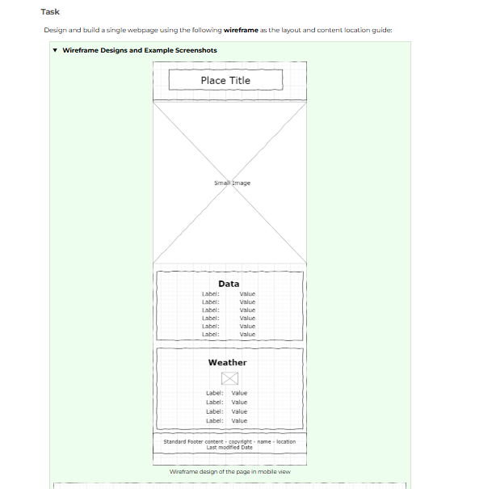
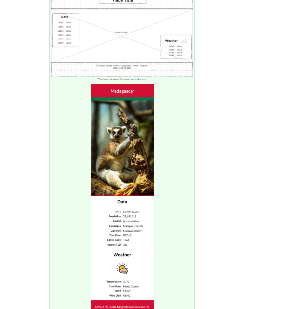
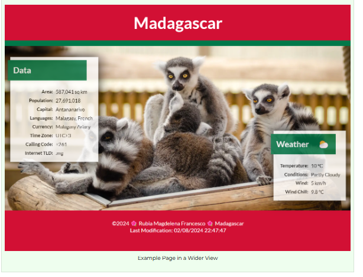

# W03 Assignment: Country Page

## Overview

In this assignment, you will apply the concepts from the learning activities to the design and development of a web page. The subject of the page is a country or place where you live, have visited, or wish to visit. There are specific functional and developmental requirements for the page's layout, design, and content.

## Associated Course Learning Outcomes

1. Develop responsive web pages that follow best practices and use valid HTML and CSS.
1. Demonstrate proficiency with JavaScript language syntax.
1. Use JavaScript to respond to events and dynamically modify HTML.
1. Demonstrate the traits of an effective team member including clear communication, collaboration, fulfilling assignments, and meeting deadlines.

## Task

Design and build a single webpage using the following wireframe as the layout and content location guide:

Wireframe Designs and Example Screenshots
Wireframe in Mobile View
Wireframe design of the page in mobile view
Wireframe in a Wider View
Wireframe design of the page in a wider view
Screenshot example of Place page in mobile view
Example Page in Mobile View
Screenshot example of Place page in a wider view
Example Page in a Wider View
You can create your own free wireframe designs using the online application jGraph-Diagrams.net, or you can download and install the JGraph program on your computer. There are many other viable wireframe design applications, including Moqups. You will need to create your own wireframe designs later in the course.

## Instructions

File and Folder Setup
1. In your wdd131 local repository folder, add a new HTML file named "place.html".
1. Add a CSS file or files in the appropriate subfolder.
1. You may organize this assignment's media queries using one CSS file or multiple CSS files.

Add a JavaScript file to the appropriate subfolder.
HTML
1. Include the standard HTML document and <head> elements.
1. Refer to the frontend development standards if you need to review standards.

1. Be sure to link your css file(s).
1. Reference your JavaScript file using a defer attribute.
1. Create the structure and layout for the page by referencing the wireframe and example screenshots provided above.
1. Important: It is required that you match the wireframe components and basic positioning of those components as shown in the wireframes.

The "hero" images must utilize the srcset responsive design method to provide different images based on screen size. You can implement this requirement by using either the picture element or a basic img approach. Ensure that the image subjects and dimensions support the page's subject, design, and layout.
Assets
You may use your own images or select from stock photos available on pexels.com or unsplash.com, as well as other resources.

Ensure compliance with licensing requirements and provide appropriate credentials if necessary. Many images on these sites are free to use and do not require attributions, however it is always important to review the licensing terms.

Screenshot of IconFinder.com download for SVG
Screenshot of iconfinder.com download options
1. Use the WebP image format for the hero images.
1. Use the SVG image format for the weather icon in the mobile view.
1. An SVG can be downloaded from most icon service sites like iconfinder.com.

1. Use an emoticon or equivalent for the weather icon ⛅ in the wider view by the "Weather" heading.
1. The weather will be static at this point, so pick an image/icon that matches your stated conditions.

CSS

Important: You are responsible to implement good design principles of alignment, color contrast, proximity, repetition, white space, and general usability in all of your work.

1. Select a color scheme that supports the country or place.
1. For example, the webpages screenshotted above use the colors of Madagascar's flag.

1. The typography choice is up to you.
1. The minimum styling requirements include:

Matching the layouts shown in the wireframes
1. Using a media query or queries.
1. Using global CSS variables.
1. Using a pseudo-element for the weather icon in the large view located after the heading "Weather".

JavaScript
1. The page footer must include the current year and the date the document was last modified.
1. In your JavaScript file, provide code to support the following requirements:
1. Use JavaScript to display the wind chill factor in the "Weather" section of the page as shown in the examples. The wind chill factor should be calculated and displayed when the page loads.
1. At this point in the course, you should define variables that use static values for the temperature and wind speed, matching the static, displayed values you have in your weather section content.
1. The next course will cover how to use third-party APIs to get real-time weather data.

1. Write a function named "calculateWindChill" that returns the wind chill factor when passed the necessary arguments (temperature and wind speed). The function should use one line of code that returns the result of the wind chill calculation. Your formula should be based upon the location's preferred units (°C or °F).
1. Using AI to help determine this formula might be a good approach.

Do not call the calculateWindChill function unless the following conditions are met:
Viable Wind Chill Calculations
Metric	Imperial (English)
Temperature	<= 10 °C	<= 50 °F
Wind speed	> 4.8 km/h	> 3 mph
1. If the conditions are not met, then display "N/A", which means "not applicable".
1. Right now your code is using static inputs, but you want to have this provision coded in preparation for using dynamic, real-time inputs.

## Testing

1. Continuously check your work by rendering the page locally using Live/Five Server in VS Code.
1. Use the browser's DevTools to check for JavaScript runtime errors in the console or click the red error icon in the upper right corner of DevTools.
1. Use DevTools CSS Overview to check your color contrast.
1. Generate the DevTools Lighthouse report and run diagnostics for Accessibility, Best Practices, and SEO in both the mobile and desktop views.
1. It is best to test your page in a Private or Incognito browser window.

Do not worry if the Best Practices report comes back low for the use of a content delivery network. We are using the Church's media library on purpose.

## Audit and Submission

1. Commit your local repository and push or upload your work to your GitHub Pages enabled wdd 131 repository on GitHub.
1. Use this ✔ Page Audit Tool to check basic HTML and CSS standards and requirements.
1. Share your work by posting your URL in the course's Microsoft Teams Week 03 Forum and comment on your peers' work by providing constructive feedback.
1. Return to Canvas and submit the correct GitHub Pages enabled URL.

<https://your-github-username.github.io/wdd131/place.html>

<https://app.diagrams.net/>

<https://www.pexels.com/>

<https://www.pexels.com/>

<https://unsplash.com/>

<https://www.freepik.com/icons>

<https://video.byui.edu/media/t/1_78w5ieoo>
