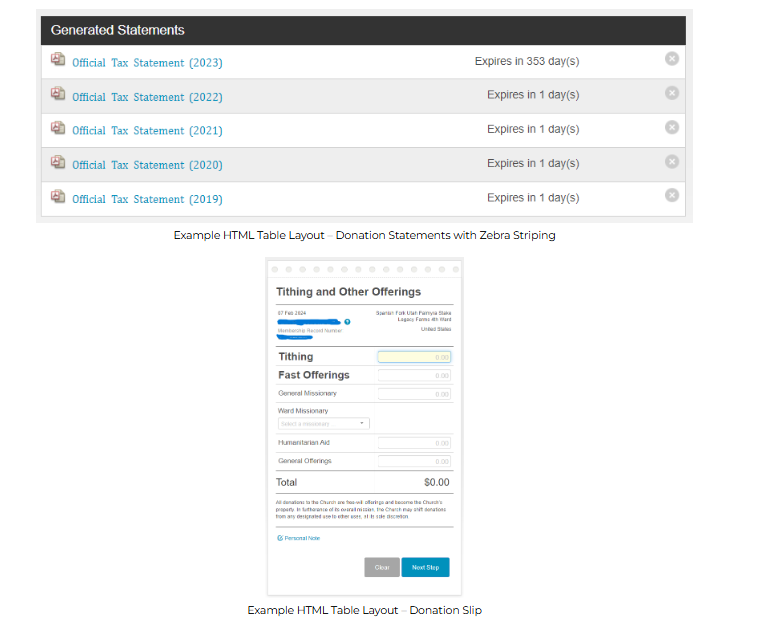
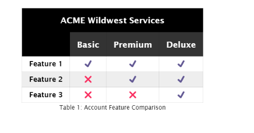

# W04 Learning Activity: HTML Tables

## Overview

HTML tables provide a structured way to represent data including tabular data, which traditionally is presented in rows and columns.

## Course Learning Outcomes

1. Develop responsive web pages that follow best practices and use valid HTML and CSS.
1. Here are some examples of HTML table structures that are used on the Church's donation site.

Screenshot of table use for Church donation statements.
Example HTML Table Layout – Donation Statements with Zebra Striping
Screenshot of table use on donation slip
Example HTML Table Layout – Donation Slip
Do you think an HTML table is the best choice for this donation slip form with inputs?
What is the purpose of the top edge row of holes and the dotted perforation line?

## Prepare

1. A key design issue with table markup is that HTML tables have been misused for page layout. Do not use HTML table structures for page layout, as this creates several problems:
1. The markup becomes bloated, which can cause confusion and make it hard to maintain and debug the page. There are better choices.
1. Table layouts reduce accessibility for the visually impaired when used for page layout instead of their intended purpose.
1. Tables are not ideal for responsive page behavior.
1. Tables are a useful and familiar way to display structured data. They are accessible to screen readers and other assistive technologies. The following resources will help you understand the best practices for using tables in HTML.

Ponder: HTML Advanced Features and Accessibility – MDN
Practice: Example CodePen ☼ Table Structure and Formatting

The examples use zebra striping to improve readability. Zebra or candy striping is the practice of coloring every other row in a table to improve readability. This is done using the nth-child pseudo-class.

## Activity Instructions

Build the following HTML table.

1. A screenshot of the table build assignment example.
1. Use the thead and tbody tags in your table structure.
1. Use a caption element within your table to display the "Table 1: Account Feature Comparison" caption.
1. The color scheme is your choice.
1. You must include zebra striping using nth-child pseudo-class.
1. You can use built-in emoticons of ✔️ and ❌ or copy them from this page.

## Check Your Understanding

Example Solution – CodePen ☼ HTML Table: Acme Wildwest

<https://developer.mozilla.org/en-US/docs/Learn_web_development/Core/Structuring_content/Table_accessibility#tables_for_visually_impaired_users>

<https://codepen.io/BYU-Idaho/pen/JoPqzqQ>

<https://codepen.io/BYU-Idaho/pen/yyyaoyr>
