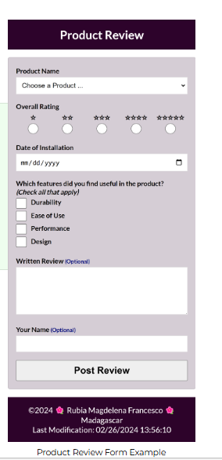

# W05 Assignment: Product Review Form

## Overview

In this assignment, you will create a product review form page. You will apply good form design principles, meet specific field requirements, and include a submission confirmation with a counter. Additionally, the form must be user-friendly on both mobile and desktop screens.

Mobile view screenshot example of product review form
Product Review Form Example

## Task

Build an HTML form with a confirmation page that meets the specified requirements. The design is your choice but must follow good form design principles. Here is an example screenshot of what you will build.

## Associated Course Learning Outcomes

1. Develop responsive web pages that follow best practices and use valid HTML and CSS.
1. Demonstrate proficiency with JavaScript language syntax.
1. Use JavaScript to respond to events and dynamically modify HTML.
1. Demonstrate the traits of an effective team member including clear communication, collaboration, fulfilling assignments, and meeting deadlines.

## Activity Instructions

File and Folder Setup
1. Create a new file named "form.html".
1. Add supporting CSS files and JavaScript files as needed and place them into their appropriate folders.

HTML
1. Include the standard HTML head and body components required in this class and include the common footer content used on assignments.
1. The HTML form must have the following fields, attributes, and functionality:

Form
1. The form itself should use a method of "get" in order to be supported on GitHub.
1. The action should reference a form confirmation page named "review.html".

Product Name
1. Use a select element with an appropriate id attribute, name attribute, and set it to be required.
1. The first option in the select element is an instructional placeholder that says "Select a Product ..." and is disabled and selected so that it displays by default but cannot be clicked by the user.
1. The remaining options are created dynamically using a provided product array.
1. Each option must have a value attribute that is the product name.
1. A product array of objects is provided below to help you understand how to build a select field with the dynamic options. Normally the data would come from an external source.

```js
const products = [
  {

id: "fc-1888",
name: "flux capacitor",
averagerating: 4.5

  },
  {

id: "fc-2050",
name: "power laces",
averagerating: 4.7

  },
  {

id: "fs-1987",
name: "time circuits",
averagerating: 3.5

  },
  {

id: "ac-2000",
name: "low voltage reactor",
averagerating: 3.9

  },
  {

id: "jj-1969",
name: "warp equalizer",
averagerating: 5.0

  }
];
```

Overall Rating
1. The overall product rating should have five levels (1 to 5) or stars.
1. The example form uses star entities ☆ (&star;) to display the level. You are free to employ a design of your choice. For example, here is another example of using stars that fill up on selection: Form Input Radio Star+ – CodePen.

Use a input of type radio for each of the levels.
The required attributes are an id, name (each of the radio buttons should have the same name value), and required
Why should each of the radio buttons that are part of this rating have the same name value?

Date of Installation
Use a input of type date to allow the user to select the date the product was installed.
The required attributes are an id, name, and required
Useful Features
1. This field allows the user to select all the listed features that they found useful.
1. This is a check all that apply field.
1. Use a input of type checkbox
1. Each checkbox should have an id, name, and value attribute.

Written Review
Use a textarea element to allow the user to write a review.
The required attributes are an id and name
The written review is not required by the user.
User Name
1. Use a input of type text for the user to enter their name.
1. Add the id and name attributes.
1. The user name entry is optional.

Form Submission Button
1. Use a input of type submit with an appropriate value that indicates the form action purpose.
1. Each form field must have an associated label.
1. Check that the keyboard tab order is correct.
1. Include the common footer content found on all assignments.

CSS
1. Use your own color scheme and typography choices.
1. You are responsible for practicing good design principles of alignment, color contrast, proximity, repetition, and usability in all of your work.
1. Apply good design principles by laying out the form according to the HTML forms learning activity guidelines. Create a visually appealing design that adheres to the design principles that support usability and provide a positive user experience.

JavaScript
1. Use JavaScript to populate the Product Name options where the array's name field is used for the select option display and the array's id is used for the value field.
1. Copy the following array of product objects into your JavaScript file to use as the data source.

Product Array
Use localStorage to store and track the number of reviews completed. Each time the review.html page loads successfully after form submission, increment the counter by one.

## Testing

1. Continuously check your work by viewing the page locally using Live Server in VS Code.
1. Use the browser's DevTools console to check for JavaScript runtime errors, or click the red error icon in the upper right corner of DevTools.
1. Use DevTools CSS Overview to check your color contrast.
1. Generate the DevTools Lighthouse report and run diagnostics for Accessibility, Best Practices, and SEO in both the mobile and desktop views.
1. It is best to test your page in a Private or Incognito browser window.

Submission and Audit
1. Commit your work locally and push your code to your GitHub Pages-enabled wdd131 repository.
1. Use this ✔ Page Audit Tool to self-check your work for some required HTML elements and CSS content. This audit tool is also used by the assessment team.
1. Share your work by posting your URL in the course's Teams Week 05 Forum and provide constructive feedback on your peers' work.
1. Return to Canvas and submit your correct GitHub Pages enabled URL.

<https://your-github-username.github.io/wdd131/form.html>



<https://codepen.io/BYU-Idaho/pen/gbbwxrv>
